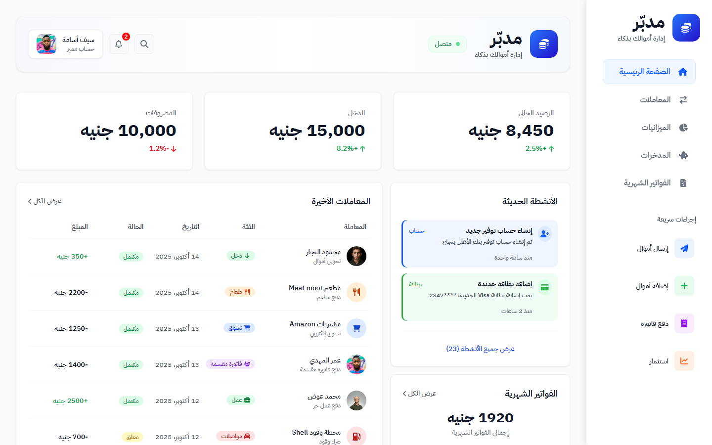
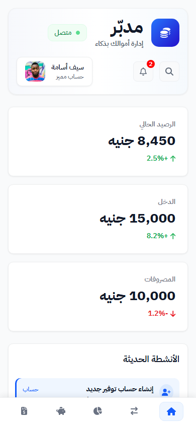

# مدبّر (Mudabbir): Arabic Finance Dashboard

A responsive **Arabic (right-to-left)** personal-finance dashboard built with **HTML5 and CSS3 only**, with no frameworks and no JavaScript.

🔗 **Live demo:** https://fadytareksamir.github.io/Mudabbir-dashboard/

## Features

- Full **RTL layout** with the IBM Plex Sans Arabic font
- Dashboard layout built with **CSS Grid**, with cards that span several rows and columns
- Sidebar, header, summary cards, transactions table, monthly bills, budget progress bars, account summary
- **Income vs. expenses bar chart** made with CSS only
- **Payment cards that flip in 3D** on hover (`perspective`, `transform-style`, `backface-visibility`)
- **Responsive** on every screen size:
  - **Laptop:** 3-column grid
  - **Tablet:** icon-only sidebar and 2 columns
  - **Mobile:** the sidebar becomes a **bottom navigation bar**, with 1 column

## Built with

HTML5 · CSS3 (Grid, Flexbox, Media Queries, Transforms)

## Run it locally

No installation needed. Open `index.html` in your browser.

## Notes

- The UI design was provided as an assignment in the Route Academy Frontend course.
- I built the layout and the main sections, and used AI assistance to help finish the remaining sections and the responsive design. I reviewed and understand every part of the code.

---

Made by **Fady Tarek Samir** · [LinkedIn](https://www.linkedin.com/in/fady-t-samir-1b81a1323)
